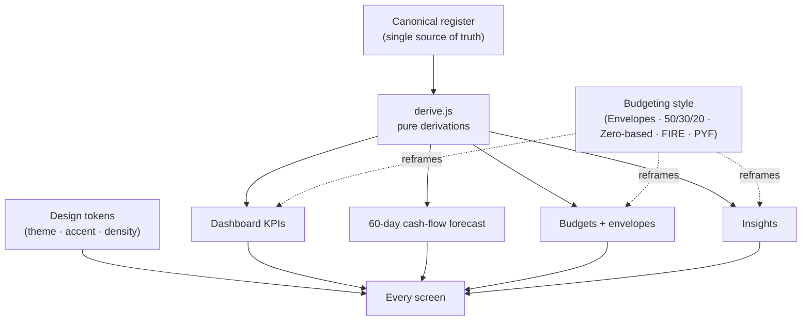

# Finance Freedom — "Ledger"

**A personal-finance command center: the soul of Microsoft Money, rebuilt for 2026.**
Accounts, cash flow, budgets, bills, investments, net worth, and debt payoff pulled into one
editorial workspace where **every figure is derived from a single canonical register — computed, never hand-typed.**

`React` · `Vite` · `JavaScript` · token-driven design system · 15-screen desktop cockpit

**▶ [Live demo](https://garthpuckerin-finance-freedom.vercel.app)** · [Case study](https://garthpuckerin.com/project-finance-freedom) · [garthpuckerin.com](https://garthpuckerin.com)

> **This is the cockpit, not the engine.** A sanitized, mock-data demo of the product experience.
> The production backend, bank/brokerage aggregation, transaction sync, and the financial engine
> (forecasting, categorization, reconciliation) are a separate private codebase. See
> [What's real vs. illustrative](#whats-real-vs-illustrative).

---

## The problem

Running a whole financial life means a dozen disconnected views — bank apps, spreadsheets, brokerage
dashboards, bill reminders — and no single, data-dense answer to *"where do I actually stand?"*
Finance Freedom is the one workspace that answers it, for the power user who wants Quicken's depth
but refuses Quicken's interface.

## What it shows

- **Glanceable dashboard** — net worth, cash-flow snapshot, upcoming bills, budget pulse
- **60-day cash-flow forecast** with low-point warnings
- **Budgeting your way** — pick a methodology (Envelopes, 50/30/20, Zero-based, FIRE,
  Pay-yourself-first) and the Dashboard, Budgets, and Insights all re-derive around it
- **Accounts** grouped by type — cash, credit, investment, retirement, assets
- **Bills & deposits** with autopay and a calendar view — *autopay auto-enters a
  recurring bill into the register on schedule so forecasts and budgets reflect it;
  it never connects to a bank or biller, and no real money moves*
- **Investments** with cost basis and gain/loss
- **Snowball / avalanche** debt-payoff planning
- **Auto-categorization rules** matched against payees
- **First-run onboarding wizard**, ⌘K command palette, token-driven design system
  (light/dark + accents), and an iOS-framed mobile companion

## Architecture — coherence is the feature

Every summary, KPI, and chart derives from **one canonical register** rather than being typed as
separate snapshots. The running cash-flow balance reconciles per event, budgets roll up from the
same transactions the register shows, and renaming a source propagates everywhere. Demo data that
doesn't reconcile makes a finance product look broken — so the whole app computes from a single source.



The budgeting-style choice is a *lens* over the same ledger: switching from Envelopes to FIRE doesn't
change the data, it re-derives what the numbers *mean* (savings rate, FI number, years-to-FI) — and it
does so consistently across every screen, because they all read from the one derivation layer.

## What's real vs. illustrative

Honesty matters more than polish, so here's the exact boundary:

| Aspect | In this public demo | In the private production build |
|---|---|---|
| **Data** | Mock register, deterministically generated, slides with the calendar | Real accounts via bank/brokerage aggregation + transaction sync |
| **Derivations** | Real — the forecast, budgets, and KPIs genuinely compute from the register | Same discipline, on real data, with a fuller financial engine |
| **AI assistant** | Grounded prompt over the mock register | Real local-LLM (Ollama) categorization, insights, and chat — no data leaves the machine |
| **Persistence** | In-memory / localStorage | Postgres with fail-closed row-level security, `Decimal` money, audit log |
| **Backend** | None — frontend only | Next.js / Prisma / Postgres, real-dependency (containerized Postgres) concurrency tests |

The production engine is private by design — the demo proves the *product experience and the
data-modeling discipline*; the engine is the IP.

## Run it locally

```bash
npm install
npm run dev      # Vite dev server
npm run build    # production build
npm run test:e2e # Playwright smoke tests
```

## Stack

React 18 · Vite · JavaScript · a token-driven design system (theme/accent/density axes) ·
Playwright for e2e. No backend — every number is derived client-side from the mock register.

---

*Built by [Garth Puckerin](https://garthpuckerin.com). One system revealed every Thursday.*
