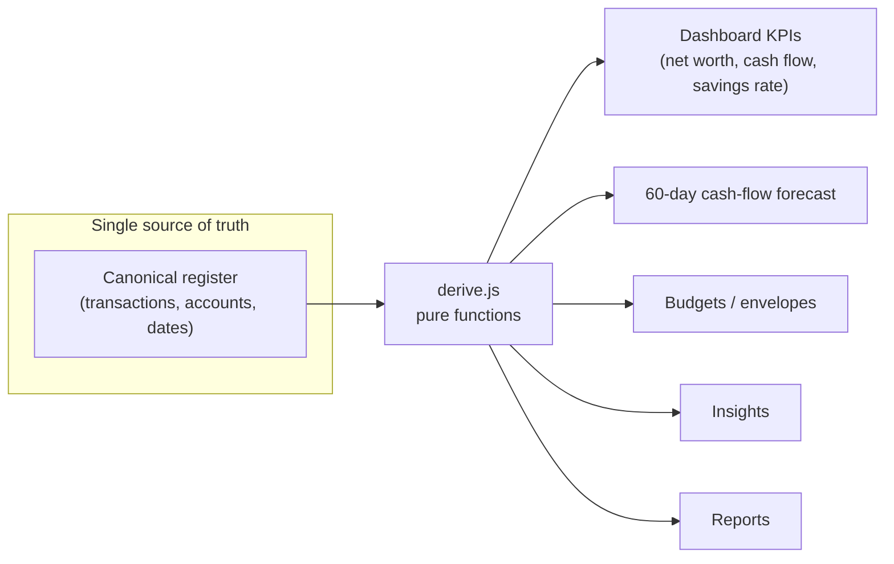
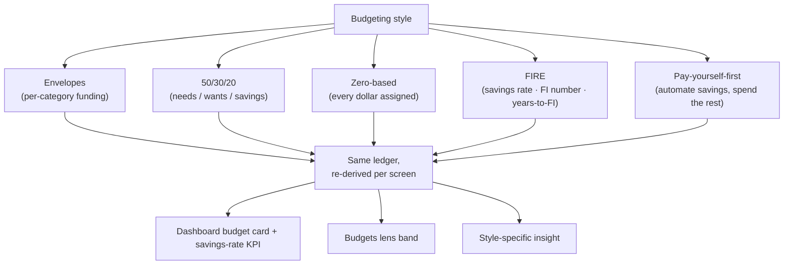

# Architecture

Finance Freedom's cockpit is built on one principle: **every number a user sees is *derived*, never
hand-typed.** In a finance product, data that doesn't reconcile reads as broken — so the whole app
computes from a single canonical register.

## The derivation model

Nothing downstream stores its own copy of a total. Rename a payee and it propagates to the register,
the category rollups, the budget that references it, and the insight that mentions it — because they
all read the same derived values. The running cash-flow balance reconciles per event; budgets roll up
from the exact transactions the register shows.

## The budgeting-style lens

A budgeting *style* doesn't change the data — it re-derives what the data **means**, consistently
across every screen:

Switching to FIRE reframes the Dashboard's savings-rate KPI goal, adds a FI-number / years-to-FI band
to Budgets, and injects a FIRE insight — all from one derivation module, synced via a lightweight
event so the picker and every screen stay in lockstep.

## The design system

A token-driven system on three axes — **theme** (light/dark), **accent**, **density** — so every
surface re-derives from a handful of variables rather than hard-coded colors. A live
`design-system.html` reference ships with the app.

## What's not here

The backend, bank/brokerage aggregation, transaction sync, and the financial engine (forecasting,
categorization, reconciliation) are a separate private codebase. This repo is the **cockpit** — it
proves the product experience and the data-modeling discipline; the engine is the IP. See the
[real-vs-illustrative table](../README.md#whats-real-vs-illustrative) in the README.
